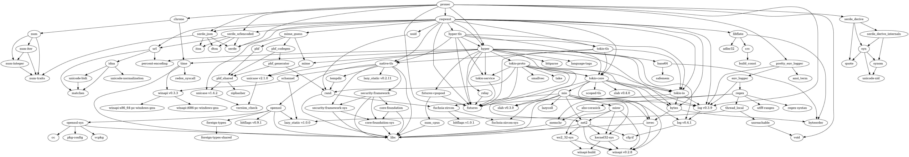

# proxer-rs
[](https://crates.io/crates/proxer)
[](https://crates.io/crates/proxer)
[](https://travis-ci.org/cuechan/proxer-rs)

Access [proxer.me](https://proxer.me) with rust


# Making Requests

Making requests is fairly simple:


```rust
let prxr = proxer::Client::new("yourapikey");
// ...or load the api-key from an environment variable
let prxr = proxer::Client::with_env_key("PROXER_API_KEY");


// everything is strong typed. You can't pass wrong parameters
let req = api::info::GetFullEntry { id: 53 };


// execute the request
let res = prxr.execute(req).unwrap();

// check the response
match res {
	Ok(data) => println!("{:#?}", data),
		Err(e) => {
			match e {
				error::Error::Api(k)    => panic!("API error: {}", k),
				error::Error::Json(k)   => panic!("something is wrong: ", k),
				error::Error::Http    => panic!("interwebs error"),
				error::Error::Unknown => panic!("i dont know what happened"),
			}
		}
	}
}

```

This example creates a api object and fetches the full data for an entry

The library is as strong typed as possible (which is a good thing for guaranteeing type safety).
It tries to be a 1:1 wrapper to the api while providing some nice tweaks like `Iterator`s for pageable endpoints.


```rust
let prxr = Client::with_env_key("PROXER_API_KEY").unwrap();

let req = api::info::GetComments {
	id: 53,
	p: None,
	limit: Some(100),
	sort: None,
};


// create a pager(`Iterator`) for the request
let pager = req.pager(prxr);


// iterate over the list
for comment in pager {
	// Now, new comments are automagically fetched when the end of a page is reached

	// there is still some error handling
	let comment = comment.expect("something went wrong");

	println!("{}: {}", comment.username, comment.rating);
}
```


# Dependencies


